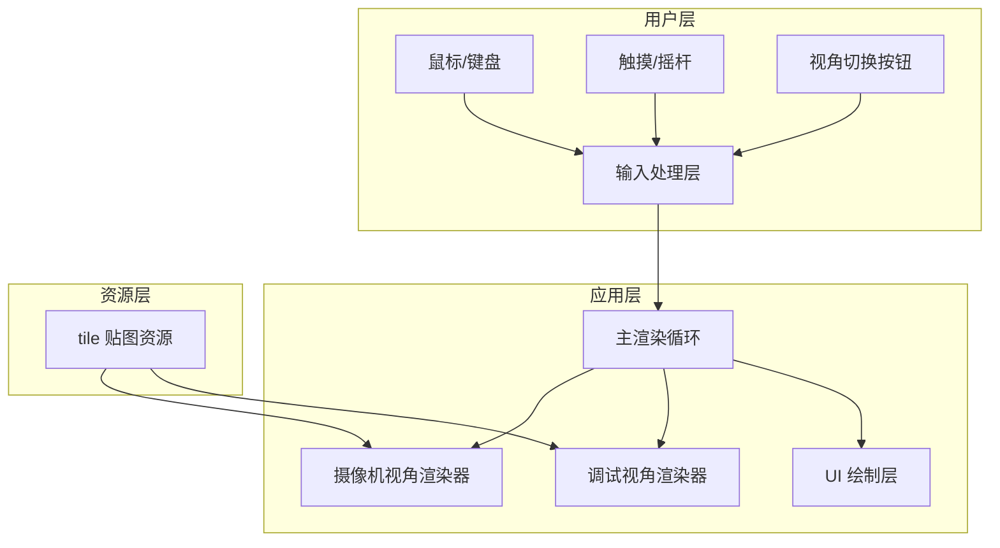

# 技术架构文档 — 伪 3D 2D 地图渲染器

## 1. 架构设计

## 2. 技术选型

- **前端框架**：原生 JavaScript + Vite
  - 本项目核心是 Canvas 2D 像素级渲染与自定义数学投影，原生 JS 对 Canvas API 的直接操作最轻量、最可控。
- **构建工具**：Vite（vanilla 模板）
  - 提供热更新与静态资源托管，便于本地预览与部署。
- **样式方案**：原生 CSS + CSS 变量
  - 全屏 Canvas 场景下 UI 控件数量少，原生 CSS 足以实现玻璃质感与响应式布局。
- **贴图资源**：`assets/tile.png`（64×64，可替换）
  - 实现时通过图像生成服务生成与用户提供样图风格相近的灰调六边形瓦片纹理；用户亦可直接替换该文件。

## 3. 路由定义

| 路由 | 用途 |
|------|------|
| `/` | 唯一页面：全屏渲染器与悬浮控制 UI |

## 4. 核心模块说明

### 4.1 摄像机（Camera）

- 属性：`n`（x 坐标）、`m`（y 坐标）、`theta`（偏转角，弧度）。
- 方法：
  - `worldToCamera(x, y)`：按用户公式把世界坐标变换到摄像机参考系 `(u, v)`。
  - `move(dx, dy)`：在摄像机局部坐标系下移动，再转换回世界坐标。
  - `rotate(delta)`：调整 `theta`。

### 4.2 大地图（World）

- 由 tile 网格构成，tile 宽度 `TILE_SIZE`（例如 64 像素）。
- 世界坐标 `(x, y)` 对应的 tile 索引为 `(floor(x / TILE_SIZE), floor(y / TILE_SIZE))`。
- 每个 tile 使用同一贴图；通过贴图重复形成大地图。

### 4.3 摄像机视角渲染器

- 渲染目标：离屏 Canvas，尺寸 1500 × 2500 像素。
- 对渲染目标中的每个像素 `(u, v)`，反推世界坐标 `(x, y)`，再采样 tile 贴图颜色。
- 将离屏 Canvas 等比例缩放绘制到屏幕 Canvas 上。

### 4.4 调试视角渲染器

- 以俯视图方式绘制世界网格、摄像机位置、朝向射线与采样范围矩形。
- 覆盖显示坐标、角度、FPS 等调试信息。

### 4.5 输入处理层

- 键盘：WASD / 方向键移动。
- 鼠标：画面中央区域拖拽旋转；左下角区域拖拽模拟摇杆。
- 触摸：单指左下角摇杆、单指中央滑屏旋转、点击按钮切换视角。

## 5. 关键性能策略

- 使用离屏 Canvas 作为 1500×2500 的固定分辨率渲染目标，避免每帧调整屏幕 Canvas 尺寸。
- 摄像机视角采用“按像素反推世界坐标”的反向采样，避免遍历整个世界。
- 使用 `requestAnimationFrame` 驱动渲染循环。
- 对移动输入使用被动事件监听器，减少滚动阻塞。
